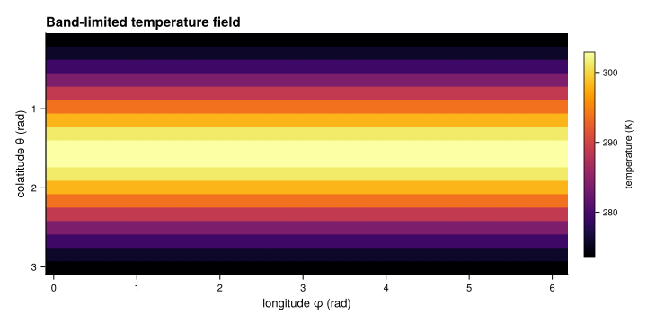
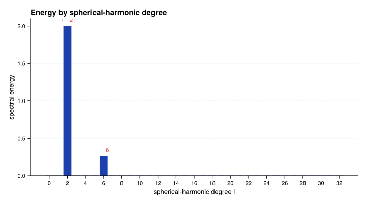
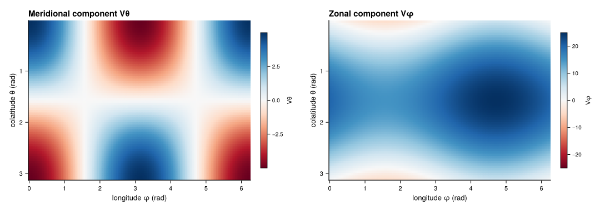
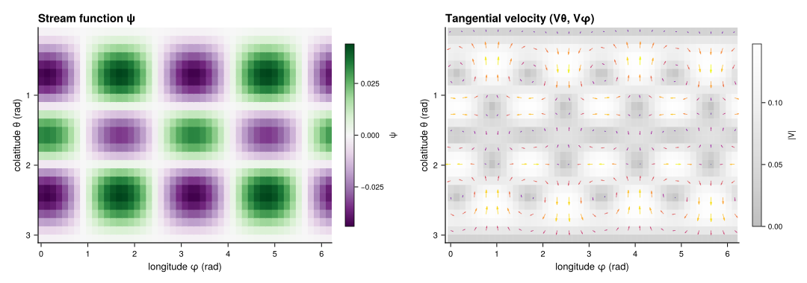
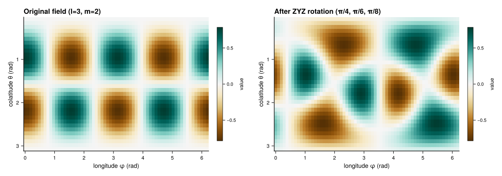

# Examples Gallery

Seven copy-ready examples walk through the most common SHTnsKit workflows:
scalar transforms, spectral analysis, vector decomposition, spectral PDE
solving, performance measurement, coordinate rotation, and MPI distribution.

Every Julia block is executed by the package test suite so it tracks the
current API. Figures are generated by
`docs/scripts/generate_example_figures.jl` and checked into
`docs/src/assets/`.

| Task | Example |
|:---|:---|
| transform a scalar field | [Scalar roundtrip](#Scalar-roundtrip) |
| inspect energy by degree | [Power spectrum](#Power-spectrum) |
| decompose a tangential vector field | [Vector decomposition](#Vector-decomposition) |
| recover a stream function from vorticity | [Stream function](#Stream-function) |
| measure local performance | [Benchmark repeated transforms](#Benchmark-repeated-transforms) |
| change coordinate orientation | [Rotate a field](#Rotate-a-field) |
| distribute across MPI ranks | [Scale out with MPI](#Scale-out-with-MPI) |

## Inspect a configuration

Printing a configuration or plan shows grid dimensions, spectral truncation,
normalization convention, and Legendre mode (on-the-fly vs table). Plans also
show FFT buffer sizes. Check these before running a transform to confirm the
setup matches your intent:

```@repl inspect
using SHTnsKit
cfg = create_gauss_config(64, 66)
cfg
plan = SHTPlan(cfg; use_rfft=true)
plan
```

## Scalar roundtrip

[`analysis`](@ref) transforms a spatial field to spherical-harmonic
coefficients. [`synthesis`](@ref) transforms back. For a band-limited field
(one that lives within `lmax` and `mmax`), the roundtrip reproduces the
input to floating-point precision.

The temperature pattern below depends only on latitude. `cfg.x[i]` stores
``\cos\theta`` at each Gauss–Legendre node, so `1 - cfg.x[i]^2 = sin²θ`
peaks at the equator and vanishes at both poles. Because `sin²θ` is a
low-degree polynomial in ``\cos\theta``, it fits within the configured
`lmax = 16`:

```julia
using SHTnsKit

cfg = create_gauss_config(16, 18; nlon=33)
temperature = [
    273.15 + 30 * (1 - cfg.x[i]^2)
    for i in 1:cfg.nlat, _ in 1:cfg.nlon
]

coefficients = analysis(cfg, temperature)
reconstructed = synthesis(cfg, coefficients)
error = maximum(abs, reconstructed - temperature)

@assert error < 1e-10
println("roundtrip error: $error")
```

Spatial arrays use `(latitude, longitude)` layout. Dense coefficient arrays
use `(l + 1, m + 1)` indexing because Julia is one-based: `coefficients[3, 1]`
holds the `l = 2, m = 0` mode.

For measured or arbitrary grid data, the roundtrip computes the best
band-limited approximation — the projection onto the harmonics up to
`lmax` and `mmax`.

```@raw html
<figure class="grid-pattern-figure">
  
  <figcaption>The latitude-only temperature pattern used above. The field is warmest near the equator and vanishes at both poles, exactly as the Y&#x2082;&#x2070; mode prescribes.</figcaption>
</figure>
```

## Power spectrum

The power spectrum groups spectral energy by degree `l`. Degree `l`
corresponds to structures with angular wavelength ``\sim \pi / l``: low `l`
means large-scale features, high `l` means fine detail.
[`energy_scalar_l_spectrum`](@ref) sums the squared coefficient magnitudes
across all orders `m` at each degree, returning a vector indexed from
`l = 0` to `l = lmax`.

Dense coefficients use one-based indexing: `coefficients[l + 1, m + 1]`
stores the mode with degree `l` and order `m`. The code below seeds two
modes and confirms that `energy_scalar_l_spectrum` recovers both peaks:

```julia
using SHTnsKit

cfg = create_gauss_config(32, 34; nlon=65)
coefficients = zeros(ComplexF64, cfg.lmax + 1, cfg.mmax + 1)
coefficients[3, 1] = 2.0          # l=2, m=0: dominant large scale
coefficients[7, 4] = 0.5 - 0.1im # l=6, m=3: weaker small scale

field = synthesis(cfg, coefficients)
power = energy_scalar_l_spectrum(cfg, analysis(cfg, field))
peak_degree = argmax(power) - 1   # subtract 1: power[1] is l=0

@assert peak_degree == 2
println("peak energy occurs at degree l=$peak_degree")
```

```@raw html
<figure class="grid-pattern-figure">
  
  <figcaption>All energy sits at degrees l&nbsp;=&nbsp;2 and l&nbsp;=&nbsp;6 &mdash; the two modes seeded above. A realistic field spreads energy across a continuum of degrees; the spectrum is the standard way to read its dominant scales.</figcaption>
</figure>
```

## Vector decomposition

Any tangential vector field on the sphere splits uniquely into two parts:

- **Spheroidal (S)** — the irrotational (divergent) part, derivable from a
  scalar potential via the gradient.
- **Toroidal (T)** — the non-divergent (rotational) part, derivable from a
  stream function via the curl.

[`analysis_sphtor`](@ref) takes the two tangential components `(Vθ, Vφ)` —
the meridional and zonal velocity — and returns the spectral coefficient
matrices `S` and `T`. [`synthesis_sphtor`](@ref) reconstructs the spatial
components from those spectra.

Tangential arrays use `(latitude, longitude)` layout, same as scalar fields.
`Vθ` points toward increasing colatitude (southward); `Vφ` points toward
increasing longitude (eastward):

```julia
using SHTnsKit

cfg = create_gauss_config(64, 66; nlon=129)
Vθ = zeros(cfg.nlat, cfg.nlon)
Vφ = zeros(cfg.nlat, cfg.nlon)

for i in 1:cfg.nlat, j in 1:cfg.nlon
    θ, φ = cfg.θ[i], cfg.φ[j]
    Vθ[i, j] = 5 * cos(θ) * cos(φ)
    Vφ[i, j] = -5 * sin(φ) + 20 * sin(θ)
end

S, T = analysis_sphtor(cfg, Vθ, Vφ)
Vθ_reconstructed, Vφ_reconstructed = synthesis_sphtor(cfg, S, T)
velocity_error = max(
    maximum(abs, Vθ_reconstructed - Vθ),
    maximum(abs, Vφ_reconstructed - Vφ),
)

@assert velocity_error < 1e-10
println("vector roundtrip error: $velocity_error")
```

```@raw html
<figure class="grid-pattern-figure">
  
  <figcaption>The meridional component V&#x3B8; (left) and zonal component V&#x3C6; (right). Analysis splits these into divergent (spheroidal) and rotational (toroidal) spectra.</figcaption>
</figure>
```

## Stream function

On the sphere, the Laplacian of a spherical harmonic of degree `l` is
``-l(l+1) Y_l^m``. Inverting this relation recovers the stream function
``\psi`` from vorticity ``\zeta``:

```math
\psi_{lm} = \frac{-\zeta_{lm}}{l(l+1)}, \quad l \geq 1
```

The `l = 0` mode is a uniform offset that carries no flow, so the loop
starts at `l = 1`.

The stream function is a toroidal potential: the non-divergent velocity it
produces appears entirely in the toroidal slot of `synthesis_sphtor`. Pass
zero spheroidal coefficients so only the toroidal part contributes:

```julia
using SHTnsKit

cfg = create_gauss_config(24, 26; nlon=49)
vorticity_coefficients = zeros(ComplexF64, cfg.lmax + 1, cfg.mmax + 1)
vorticity_coefficients[5, 3] = 1.0 - 0.25im # l=4, m=2

stream_coefficients = similar(vorticity_coefficients)
fill!(stream_coefficients, 0)
for l in 1:cfg.lmax, m in 0:min(l, cfg.mmax)
    stream_coefficients[l + 1, m + 1] =
        -vorticity_coefficients[l + 1, m + 1] / (l * (l + 1))
end

stream_function = synthesis(cfg, stream_coefficients)
zero_spheroidal = zero(stream_coefficients)
Vθ, Vφ = synthesis_sphtor(cfg, zero_spheroidal, stream_coefficients)

@assert all(isfinite, stream_function)
println("stream-function range: ", extrema(stream_function))
println("maximum flow speed: ", maximum(hypot.(Vθ, Vφ)))
```

```@raw html
<figure class="grid-pattern-figure">
  
  <figcaption>The recovered stream function &#x3C8; (left) and its tangential velocity (right). Closed &#x3C8; contours mark the circulation driven by the single vorticity mode l&nbsp;=&nbsp;4, m&nbsp;=&nbsp;2.</figcaption>
</figure>
```

## Benchmark repeated transforms

Use `@belapsed` from BenchmarkTools.jl to measure median wall time across
many samples. The `$` interpolation passes variables by reference so the
macro does not measure lookup overhead. `seconds=0.2` caps total benchmarking
time — increase it for more stable estimates.

The test field mixes several spherical-harmonic modes so the transform
exercises the full `lmax` range. Always verify accuracy alongside timing:
a fast but wrong transform is useless.

```julia
using SHTnsKit, BenchmarkTools

cfg = create_gauss_config(64, 66; nlon=129)
spatial = [
    sin(2cfg.θ[i]) * cos(cfg.φ[j]) +
    0.5 * sin(cfg.θ[i])^3 * cos(3cfg.φ[j])
    for i in 1:cfg.nlat, j in 1:cfg.nlon
]

analysis_time = @belapsed analysis($cfg, $spatial) seconds=0.2
coefficients = analysis(cfg, spatial)
synthesis_time = @belapsed synthesis($cfg, $coefficients) seconds=0.2

recovered = synthesis(cfg, coefficients)
max_error = maximum(abs, recovered - spatial)
@assert max_error < 1e-10

println("analysis: $(round(analysis_time * 1e3, digits=2)) ms")
println("synthesis: $(round(synthesis_time * 1e3, digits=2)) ms")
```

For a long-running application, switch to [`SHTPlan`](@ref) for
zero-allocation in-place transforms, and use batch calls when multiple fields
share a grid. See the [Performance Guide](../performance.md) for details.

## Rotate a field

Rotations reorient a spherical-harmonic field without going through spatial
space. They mix coefficients of different orders `m` at each degree `l` via
Wigner d-matrices, so the spectral energy is exactly preserved.

Rotations use **packed storage** — a flat `ComplexF64` vector of length
`cfg.nlm` that stores only the non-redundant `(l, m)` modes for real fields.
[`LM_index`](@ref) maps a degree-order pair to the zero-based packed index;
add 1 for Julia's one-based arrays.

[`SHTRotation`](@ref) holds precomputed Wigner matrices for a given
`(lmax, mmax)`. Set Euler angles with `shtns_rotation_set_angles_ZYZ` — three
successive rotations about Z, then Y, then Z — and apply with
`shtns_rotation_apply_real`:

```julia
using SHTnsKit

cfg = create_gauss_config(32, 34; nlon=65)
input = zeros(ComplexF64, cfg.nlm)
input[LM_index(cfg.lmax, cfg.mres, 3, 2) + 1] = 1.0

rotation = SHTRotation(cfg.lmax, cfg.mmax)
shtns_rotation_set_angles_ZYZ(rotation, π / 4, π / 6, π / 8)
rotated = similar(input)
shtns_rotation_apply_real(rotation, input, rotated)

rotated_field = reshape(synthesis_packed(cfg, rotated), cfg.nlat, cfg.nlon)
orig_power = energy_scalar_packed(cfg, input)
rot_power = energy_scalar_packed(cfg, rotated)

@assert isapprox(orig_power, rot_power; rtol=1e-10)
println("rotated field range: ", extrema(rotated_field))
```

Use `synthesis_packed` to bring packed coefficients back to spatial space.
The energy assertion confirms rotation preserves total spectral power.

```@raw html
<figure class="grid-pattern-figure">
  
  <figcaption>The same field before (left) and after (right) a ZYZ Euler rotation. Rotation moves the pattern without changing its spectral energy &mdash; the assertion above checks exactly that.</figcaption>
</figure>
```

## Scale out with MPI

When fields are too large for one process, MPI distributes latitude across
ranks. The repository includes two runnable scripts:

- `parallel_roundtrip.jl` — scalar analysis/synthesis roundtrip on distributed
  `PencilArray` storage, verifies error across all ranks.
- `parallel_fft_roundtrip.jl` — same workflow using the transpose-based
  `DistTransposePlan` for m-distributed spectral storage.

```bash
mpiexec -n 2 julia --project=. examples/parallel_roundtrip.jl
mpiexec -n 2 julia --project=. examples/parallel_fft_roundtrip.jl
```

See [Distributed Computing](../distributed.md) for package setup, data layout,
and the choice between replicated and distributed spectral coefficients.
